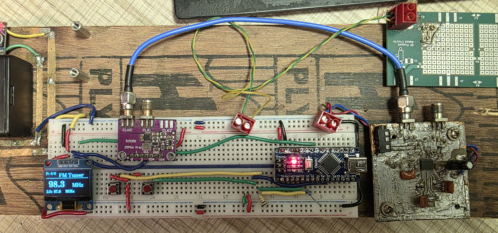
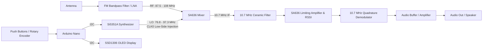

# FM Radio Tuner & Local Oscillator (LO) Controller

An Arduino / PlatformIO project that acts as an FM radio tuner local oscillator (LO) generator with an interactive OLED display and customizable input controls.

This project generates the appropriate Local Oscillator (LO) frequency on an **Si5351A** clock generator (CLK0) using **Low-Side Injection** ($f_{LO} = f_{RF} - 10.7\text{ MHz}$) to mix with standard FM broadcast band signals (87.5 MHz – 108.0 MHz).



---

## Radio Frontend Architecture (SA636 + Si5351)

This controller is designed to drive a superheterodyne FM radio receiver frontend built around the **NXP/Philips SA636** (high-performance low-voltage FM IF receiver system).



### How the SA636 Frontend Works:

1. **RF Input & Preselection**: Signals from the antenna pass through an FM bandpass preselector filter (87.5 – 108 MHz) and an optional RF low-noise amplifier (LNA) to suppress image frequencies and out-of-band interference.
2. **Double-Balanced Mixing**: The filtered RF signal enters the **SA636 mixer input**. The **Si5351A (CLK0)** injects the synthesized Local Oscillator signal ($f_{LO} = f_{RF} - 10.7\text{ MHz}$) into the SA636 oscillator input port (AC-coupled).
3. **10.7 MHz Intermediate Frequency (IF) Filtering**: The down-converted $10.7\text{ MHz}$ IF signal leaves the mixer output and passes through a standard $10.7\text{ MHz}$ ceramic filter (e.g., $330\,\Omega$ matched) to provide sharp adjacent-channel selectivity.
4. **Limiting Amplifier & RSSI**: The filtered $10.7\text{ MHz}$ IF signal enters the SA636 high-gain limiting amplifier stage, which removes amplitude noise (AM suppression) and provides logarithmic RSSI (Received Signal Strength Indication).
5. **Quadrature FM Demodulation**: An external $10.7\text{ MHz}$ LC tank/discriminator circuit attached to the SA636 quadrature detector phase-shifts the IF signal to demodulate wideband FM audio.
6. **Audio Output**: The detected analog audio output from the SA636 is routed through a de-emphasis filter and audio power amplifier (such as an LM386, PAM8403, or headphone amplifier).

---

## Features

- **Accurate Frequency Generation**: Drives an Si5351A module over I2C on `CLK0`.
- **Low-Side Injection Calculation**: Automatically calculates $f_{LO} = f_{RF} - f_{IF}$ (with default $f_{IF} = 10.7\text{ MHz}$).
- **Interactive 128x64 OLED UI**: Uses the `U8g2` library to render:
  - Current RF tuned frequency (e.g. `100.5 MHz`)
  - Calculated LO frequency (e.g. `LO: 89.8 MHz`)
  - Current tuning mode (Preset mode with preset index or Direct Manual Tuning mode)
  - Startup boot animation
- **Dual Input Modes (Configurable)**:
  - **Push Button Mode**: Up (`+`), Down (`-`), and Mode Toggle switch.
  - **Rotary Encoder Mode**: `CLK`, `DT`, and integrated push button switch.
- **Two Operating Modes**:
  - **Preset Mode**: Quickly switch between predefined favorite FM stations.
  - **Direct Tune Mode**: Step through the FM band in 100 kHz steps.

---

## Hardware Requirements

| Component | Description |
| :--- | :--- |
| **Microcontroller** | Arduino Nano (ATmega328P) |
| **Clock Generator** | Si5351A I2C Breakout Board |
| **Display** | 0.96" SSD1306 128x64 I2C OLED Display |
| **User Input** | 3x Momentary Push Buttons **OR** 1x Rotary Encoder (EC11) |
| **Receiver IC** | NXP/Philips SA636 (FM IF / Mixer / Demodulator subsystem) |
| **Power** | 5V USB / External 5V Regulated |

---

## Pinout & Wiring

### 1. Common I2C Connections

The Si5351 and SSD1306 OLED share the I2C bus:

| Pin | Arduino Nano Pin | Notes |
| :--- | :--- | :--- |
| **SDA** | `A4` | Shared I2C Data |
| **SCL** | `A5` | Shared I2C Clock |
| **VCC** | `5V` (or `3.3V` per module spec) | Power supply |
| **GND** | `GND` | Common ground |

### 2. Input Wiring

Configure the mode in [`src/main.cpp`](src/main.cpp) with `#define USE_BUTTON_MODE`:

#### Button Mode (`USE_BUTTON_MODE = 1`)
| Button | Arduino Nano Pin | Description |
| :--- | :--- | :--- |
| **BTN_PLUS** | `D2` | Frequency / Preset Up (internal pull-up) |
| **BTN_MINUS** | `D3` | Frequency / Preset Down (internal pull-up) |
| **BTN_SW** | `D6` | Mode Switch (Preset $\leftrightarrow$ Direct Tune) |

#### Rotary Encoder Mode (`USE_BUTTON_MODE = 0`)
| Encoder Pin | Arduino Nano Pin | Description |
| :--- | :--- | :--- |
| **DT** | `D2` | Encoder Data pin |
| **CLK** | `D3` | Encoder Clock pin |
| **SW** | `D7` | Encoder Push Switch (Toggle Mode) |

---

## Configuration

All main settings can be customized in [`src/main.cpp`](src/main.cpp):

- **Input Selection**:
  ```cpp
  #define USE_BUTTON_MODE 1  // 1 for Buttons, 0 for Rotary Encoder
  ```
- **Intermediate Frequency (IF)**:
  ```cpp
  const unsigned long long IF_FREQUENCY_HZ = 10700000ULL; // 10.7 MHz
  ```
- **Tuning Limits & Step Size**:
  ```cpp
  const unsigned long STEP_HZ = 100000;                  // 100 kHz steps
  const unsigned long long MIN_LO_FREQ_HZ = 76800000ULL; // 87.5 MHz RF - 10.7 MHz
  const unsigned long long MAX_LO_FREQ_HZ = 97300000ULL; // 108.0 MHz RF - 10.7 MHz
  ```
- **Preset Stations**:
  ```cpp
  const int PRESET_FM_STATIONS[] = {910, 912, 935, 983, 1005, 1018, 1030, 1064}; // In units of 100 kHz (e.g. 1005 = 100.5 MHz)
  ```

---

## Antenna System

This receiver is paired with a custom-tuned **Half-Wave Dipole Antenna** designed specifically for the FM broadcast band (87.5 MHz – 108.0 MHz):
- **Resonance & Bandwidth**: Centered around **98 MHz** with a **20 MHz bandwidth** ($S_{11} = -20.80\text{ dB}$, $\text{SWR} = 1.20$ at resonance).
- **High Sensitivity**: Delivers clean, low-noise FM reception across the entire band directly into the SA636 frontend without an external LNA.
- **Build Details & Measurements**: See the **[Antenna Design & VNA Documentation](antenna/README.md)** for full NanoVNA sweeps, 3D-printed weatherproof feedpoint hub details, outdoor mast mounting, and HFSS electromagnetic simulation.

---

## Building and Flashing

This project is configured for **[PlatformIO](https://platformio.org/)**.

### Build
```bash
pio run
```

### Upload to Board
```bash
pio run --target upload
```

*(Note: If using an Arduino Nano clone with a CH340 chip, the upload speed is preconfigured to `115200` in [`platformio.ini`](platformio.ini)).*

---

## References & Acknowledgments

- **NXP / Philips SA636**: Low-voltage high-performance FM IF subsystem with integrated mixer and quadrature detector.
- **Etherkit Si5351**: Arduino library for the Silicon Labs Si5351A clock generator.
- **U8g2**: Monochrome graphics display library for embedded displays.
