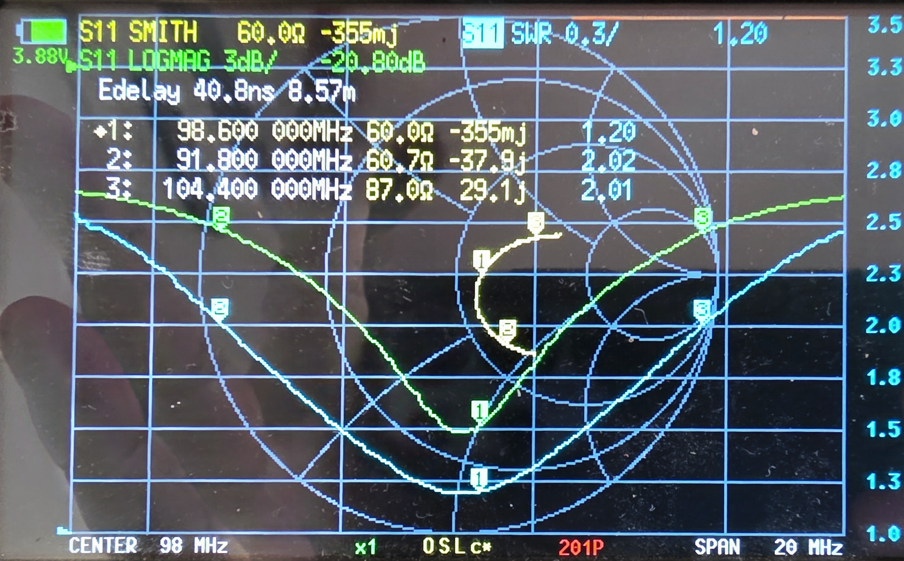
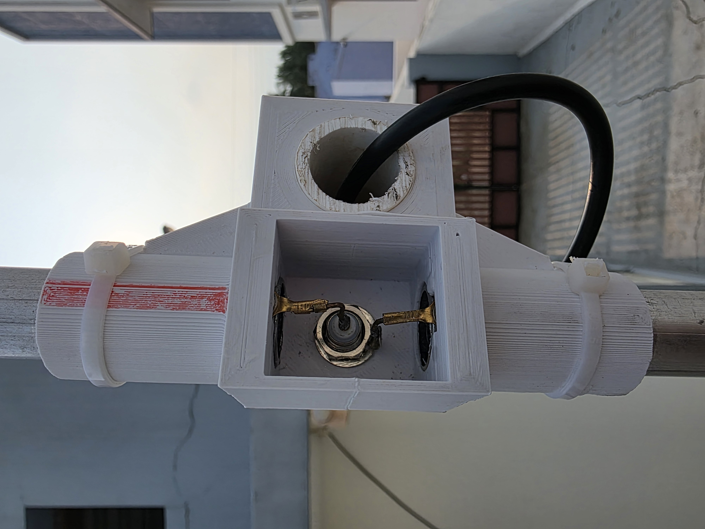
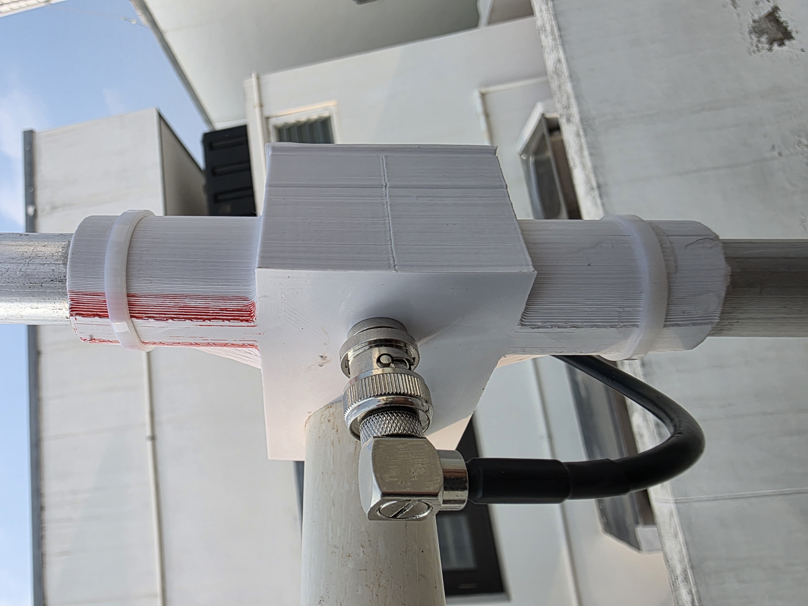
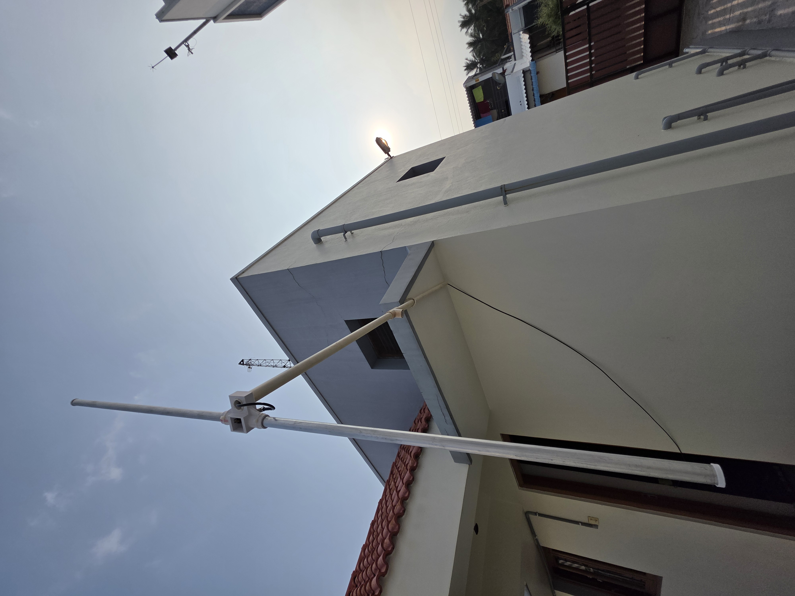
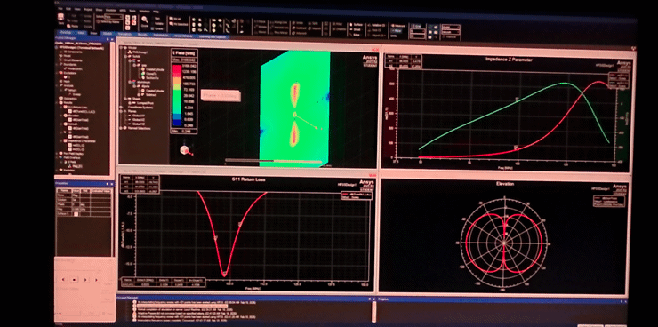

# Tuned FM Broadcast Dipole Antenna (98 MHz Center, 20 MHz Bandwidth)

A custom-built, high-performance half-wave dipole antenna precision-tuned for the standard **FM Broadcast Band (87.5 MHz – 108.0 MHz)**. 

Centered around **98 MHz** with a wide **20 MHz bandwidth**, this antenna provides exceptional sensitivity and low SWR across the entire band, delivering crystal-clear reception to the FM receiver frontend without needing an external Low-Noise Amplifier (LNA).

---

## 1. Vector Network Analyzer (VNA) Measurement & Tuning

The antenna was swept and tuned using a NanoVNA across a 20 MHz span centered at 98 MHz.

### Measured VNA Markers:

| Marker | Frequency | Impedance ($Z$) | SWR | Return Loss ($S_{11}$) | Notes |
| :---: | :---: | :---: | :---: | :---: | :--- |
| **Marker 1** | **98.600 MHz** | **$60.0\,\Omega - j0.355\,\Omega$** | **1.20** | **-20.80 dB** | **Resonance center** (near-perfect $50\,\Omega$ match) |
| **Marker 2** | **91.800 MHz** | $60.7\,\Omega - j37.9\,\Omega$ | 2.02 | ~ -9.5 dB | Lower 2:1 SWR bandwidth cutoff |
| **Marker 3** | **104.400 MHz** | $87.0\,\Omega + j29.1\,\Omega$ | 2.01 | ~ -9.6 dB | Upper 2:1 SWR bandwidth cutoff |

- **Center Frequency**: $\approx 98.6\text{ MHz}$ with an outstanding $S_{11}$ of **$-20.80\text{ dB}$** and **$1.20\text{ SWR}$**.
- **Bandwidth ($SWR \le 2:1$)**: Over **12.6 MHz** strictly within 2:1 SWR and usable with high sensitivity across the full **20 MHz span** (88 MHz to 108 MHz).
- **Smith Chart**: Shows a tight circular loop around the $50\,\Omega$ center point with minimal reactive component at resonance.

---

## 2. Feedpoint Construction & 3D-Printed Center Hub

The dipole feedpoint utilizes a custom 3D-printed weather-resistant T-hub that securely houses the RF connector and clamps the aluminum element pipes.

### Construction Details:
- **RF Bulkhead Connector**: Central chassis connector mounted directly in the lower port of the housing.
- **Element Connections**: 
  - The center conductor of the RF connector is soldered/bolted to one dipole arm using a heavy-duty copper lug.
  - The ground/shield is tied directly to the opposing dipole arm with equal lead length to preserve symmetry.
- **Element Clamping**: Rigid aluminum pipe elements slide into the reinforced lateral sleeves and are secured with cable ties and strain-relief clamps.

---

## 3. Feedline Interface & Weatherproofing

The enclosure is sealed with a custom top lid, and the coaxial feedline is attached via a low-loss right-angle RF connector.

- **Right-Angle Connector**: Relieves mechanical strain on the coaxial cable and allows clean vertical drop-down routing along the mast.
- **Weatherproof Enclosure**: Protects the electrical connections and terminal lugs from rain, humidity, and oxidation.

---

## 4. Outdoor Mast Mounting & Real-World Performance

The assembled dipole antenna is mounted elevated outdoors on a rigid non-conductive mast for optimal line-of-sight signal capture.

### Performance Highlights:
- **Clean Reception Without LNA**: Thanks to the low return loss ($-20.8\text{ dB}$) and natural resonant gain of the half-wave dipole, the receiver frontend (SA636 mixer + Si5351 LO) receives strong, low-noise RF signals across all local and distant FM broadcast stations without requiring an active pre-amplifier (LNA).
- **Horizontal Polarization**: Aligned horizontally to maximize coupling with standard FM broadcast transmitter polarization.

---

## 5. Electromagnetic Simulation (HFSS)

The antenna elements and feedpoint geometry were modeled and optimized in Ansys HFSS to verify the radiation pattern and broadband impedance matching.

